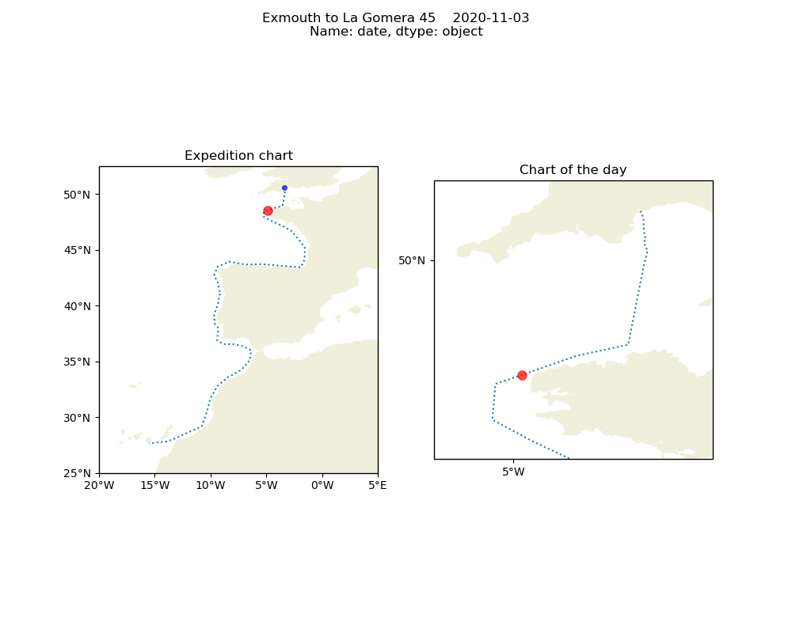

# Virtual Rowing Tour

## Loogbook 

The [log book](https://github.com/BHFock/erc_to_la_gomera_row/blob/main/log/rowing.log) serves as input for the rowed meters.

## Software installation

The required Python packages can be installed via https://www.anaconda.com

 conda install -c conda-forge cartopy

 conda install -c conda-forge fastkml
 
 conda install -c conda-forge geopy
